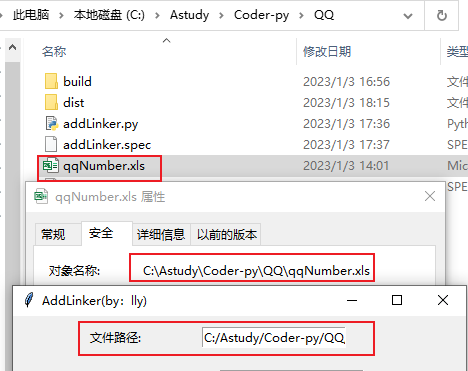
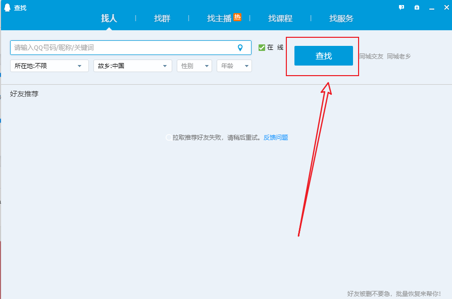
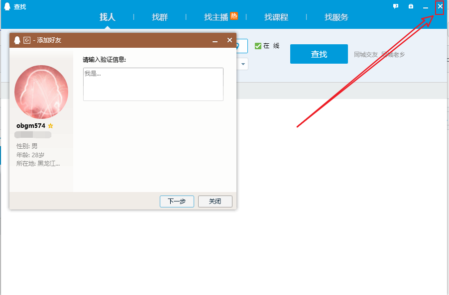

# 批量新增联系人
> 使用PyAutoGUI实现自动操作鼠标键盘进行联系人的添加
## 使用到的三方库
* xlrd2：读取excel表数据，xlrd在读取xlsx后缀表会报错，建议使用xlrd2
* PyAutoGUI：操作鼠标、键盘
## 前期准备
1. 联系人excel表数据
2. 使用定位工具获取到各个操作按钮在屏幕的对应位置
## 待优化
* 新增联系人时输入验证信息
* 联系人设置了特殊验证方式处理
* 执行结果未捕获

## 操作手册
1. 运行`addlinker.exe` 文件
2. 文件路径：输入前期准备的excel文件全路径；路径中的反斜杠(`\`)需要替换为正斜杠(`/`)
    
    > 图中的路径 `‪C:\Astudy\Coder-py\QQ\qqNumber.xls` 就需要改为 `C:/Astudy/Coder-py/QQ/qqNumber.xls` 放在文件路径的位置
3. 加好友按钮坐标：
    
    > 使用工具获取到按钮的坐标位置输入到对应位置
4. 查找按钮坐标（操作同3）
    
5. 添加按钮坐标（操作同3）
    
6. 下一步按钮坐标（操作同3）
    
7. 关闭小框按钮坐标（操作同3）
    
8. 关闭大框按钮坐标（操作同3）
    
9. 睡眠时间
> 每次操作完一步后执行休眠，单位为秒，建议5秒
10. 点击执行